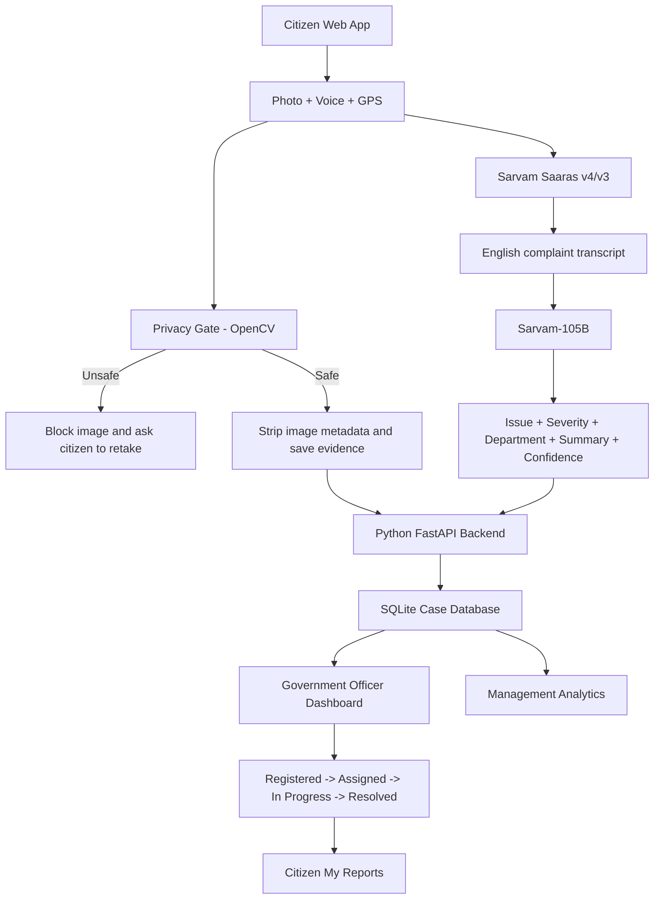

# InfraGuard AI — Architecture

## End-to-end flow

## What each technology does

| Layer | Technology | Role |
|---|---|---|
| Citizen + Officer UI | HTML, CSS, JavaScript | Screens, camera upload, microphone recording, GPS, dashboards |
| Backend | Python + FastAPI | APIs, workflow, AI calls, validation |
| Privacy | OpenCV | Face/human/QR screening before accepting image |
| Speech AI | Sarvam Saaras | Citizen voice -> text/English |
| Reasoning AI | Sarvam-105B | Issue type, severity, department, summary |
| MVP data | SQLite | Cases and status changes |
| Evidence | Local uploads | Complaint and resolution photos |
| Production target | Azure | App hosting, Blob Storage, managed database, monitoring |

## Important privacy boundary

Citizen photo -> OpenCV privacy gate -> local evidence storage.

The citizen photo is **not sent to Sarvam**. Sarvam receives audio for speech recognition
and text for complaint understanding.

## Human oversight

AI produces a recommendation. It does not make the final government decision.
The officer can review the evidence, change status, add notes and close the case.
